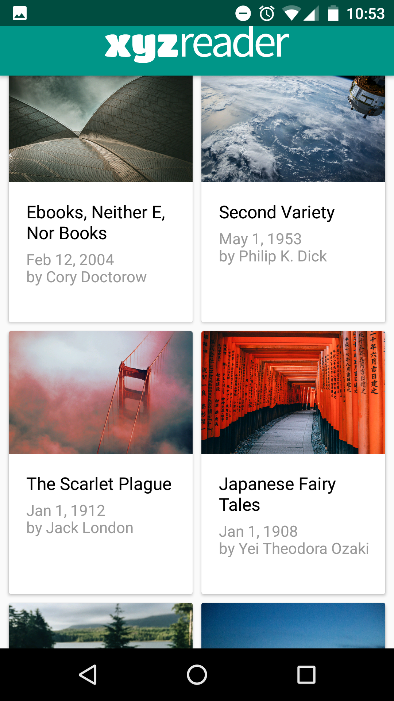
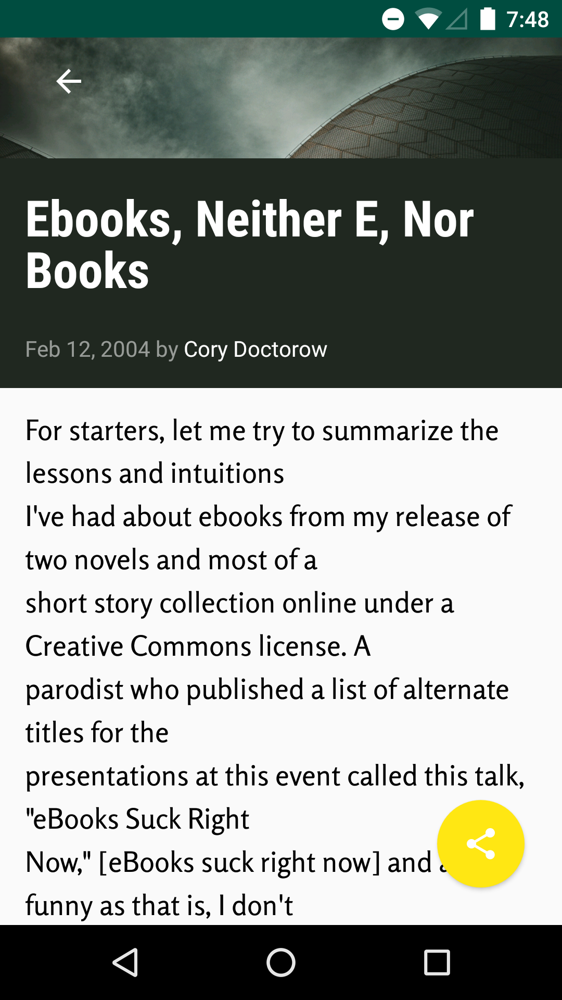

# XYZ-Reader

XYZ-Reader is an Android app that provides Material Design to a reading app.
This is part of the Android Nanodegree by Udacity. 

Contains:
* Floating Button.
* Adaptable Bars.

  
  

2
